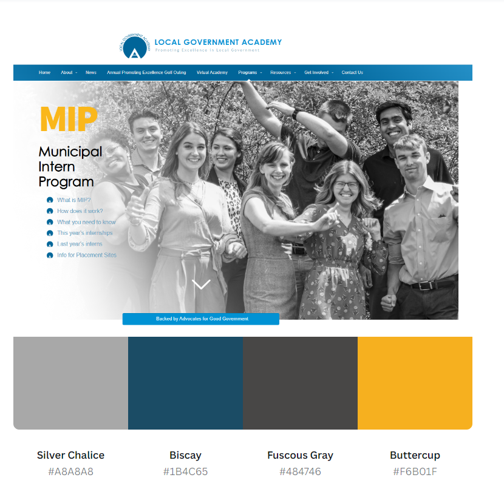
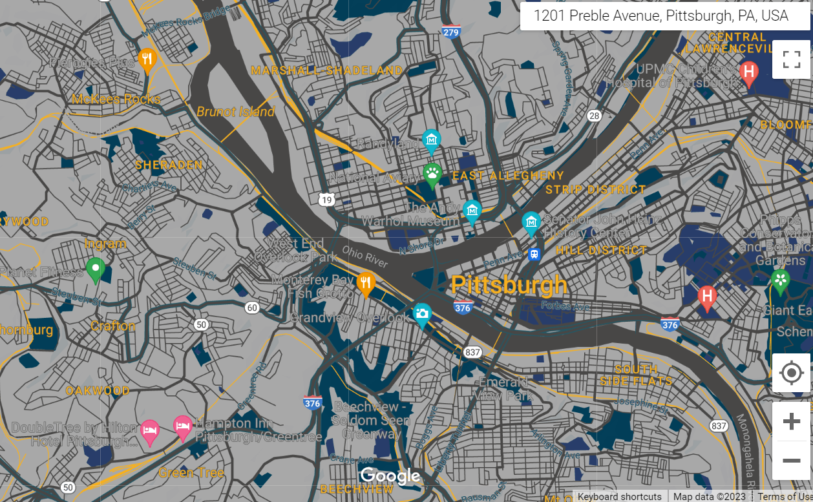
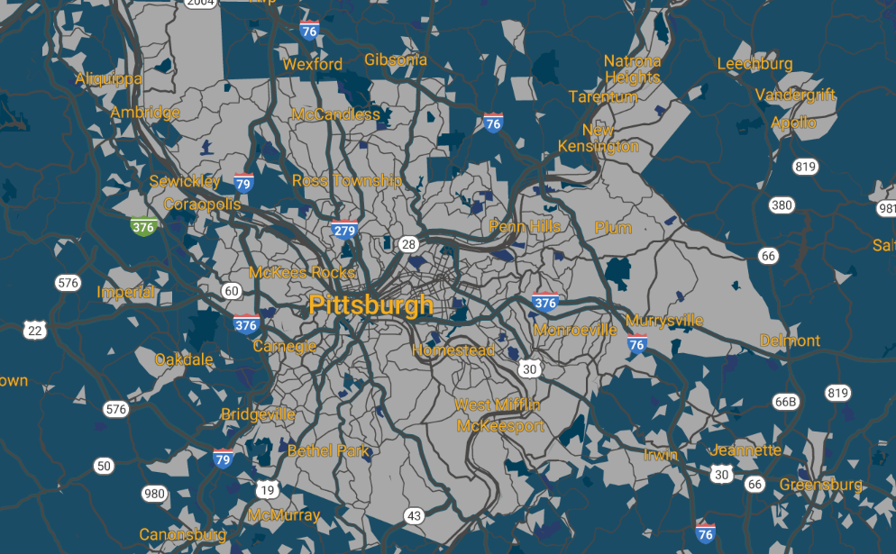
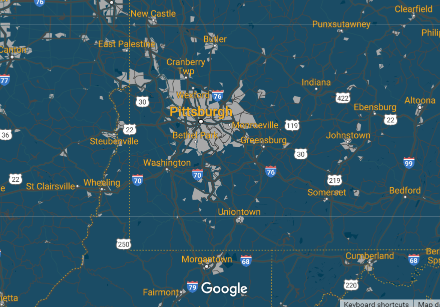

# Custom Map Assignment

## Project Summary
For this assignment, I chose the nonprofit Local Government Academy, based in Pittsburgh. Local Government Academy is looking to make their brand recognizable within Allegheny County. What they do as an organization is unique not just within the county, but throughout the country, and they want to make that clear through their branding. Developing a map that is distinctly theirs can assist them in that goal. 

A key component of Local Government Academy’s programming is their Municipal Intern Programming, which they are recruiting interns for right now. To assist in that goal, the consultant will design a map identifying the municipalities in Allegheny and surrounding counties looking for interns through Local Government Academy’s MIP. Therefore, the relevant screenshots show Pittsburgh, Allegheny County, and the whole Southwestern Pennsylvania region. 

## Process Outline

## Color Palette

## Map Zoom Extents
### Pittsburgh

### Allegheny County

### Southwestern Pennsylvania

## Lookup Table
<iframe src="https://docs.google.com/spreadsheets/d/e/2PACX-1vS7WR5UQFz1MfbGTjqbdH85sLAns338FvCb7IUCVDB0qxiGmxOQ4Ji5aL-stoI63j0VPaP7pAsnldRM/pubhtml?widget=true&amp;headers=false"></iframe>

## JSON Code Sample
[LGA Custom Map](/LGA Custom Map)
